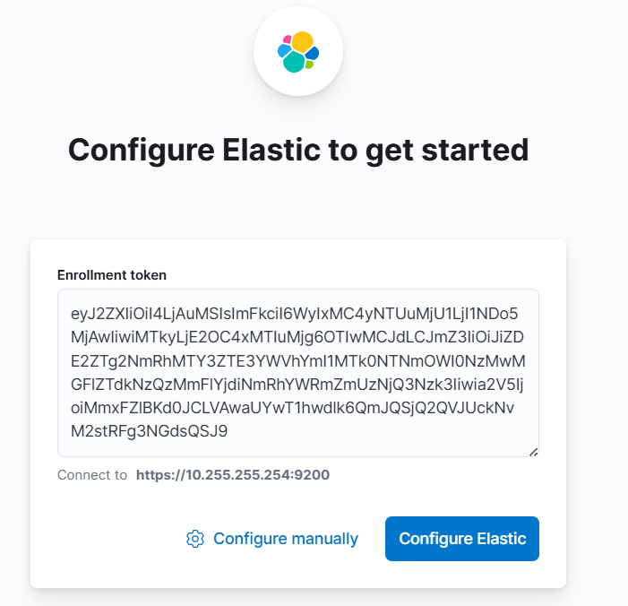
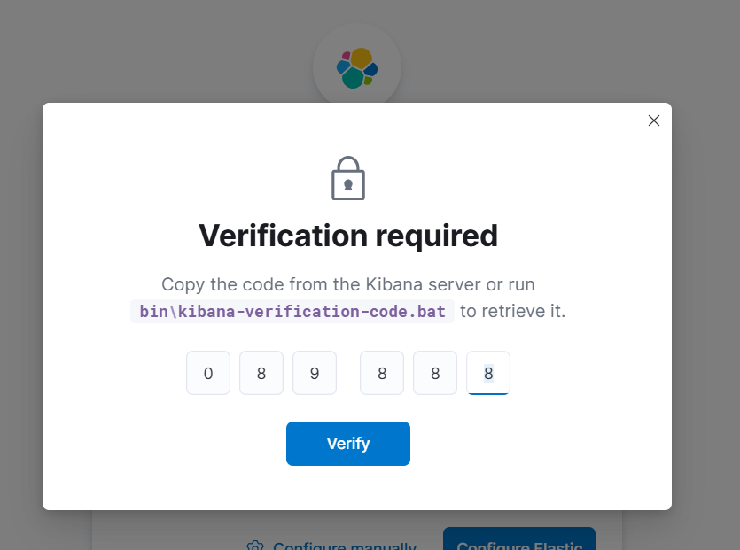
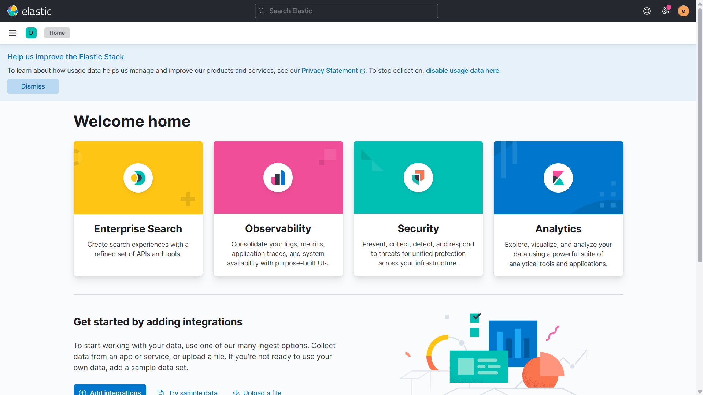

# undefined-project

<br />

## ElasticSearch

### 설치

```sh
# 엘라스틱 서치 설치
wget https://artifacts.elastic.co/downloads/elasticsearch/elasticsearch-8.0.1-linux-x86_64.tar.gz

# 엘라스틱 서치 압축해제
tar -xzf elasticsearch-8.0.1-linux-x86_64.tar.gz

# 이동 및 실행
cd elasticsearch-8.0.1
./bin/elasticsearch

# 비번과 인증서 복사할 것
# 비밀번호를 못봤을경우 초기화
./bin/elasticsearch-reset-password -u elastic

## 아래처럼 출력됨
Password for the [elastic] user successfully reset.
New value: *******************
```

### 실행확인

```sh
# 실행확인
curl --cacert /etc/elasticsearch/certs/http_ca.crt -u elastic https://localhost:9200

# tar.gz으로 받아서 실행했을경우 인증서 경로, 그외 다른 경우에도 유동적으로 확인
curl --cacert config/certs/http_ca.crt -u elastic https://localhost:9200

# 비밀번호를 입력한 뒤 응답 JSON 형태로 받기
# Enter host password for user 'elastic': *******************
```

```json
{
    "name": "Char1ey",
    "cluster_name": "elasticsearch",
    "cluster_uuid": "1fSzmGdpQqirPBDRR0lU1g",
    "version": {
        "number": "8.0.1",
        "build_flavor": "default",
        "build_type": "tar",
        "build_hash": "801d9ccc7c2ee0f2cb121bbe22ab5af77a902372",
        "build_date": "2022-02-24T13:55:40.601285296Z",
        "build_snapshot": false,
        "lucene_version": "9.0.0",
        "minimum_wire_compatibility_version": "7.17.0",
        "minimum_index_compatibility_version": "7.0.0"
    },
    "tagline": "You Know, for Search"
}
```

### 클러스터 상태 진단 API

- 인스턴스 상태 `green`, 할당되지 않은 샤드가 없는지 확인 가능

```sh
# 클러스터 상태 진단
curl --cacert config/certs/http_ca.crt -u elastic https://localhost:9200/_cluster/health
# 클러스터 상태 진단 - 응답 정리되서 나오도록
curl --cacert config/certs/http_ca.crt -u elastic https://localhost:9200/_cluster/health?pretty
```

```json
// Enter host password for user 'elastic':
{
    "cluster_name": "elasticsearch",
    "status": "green", // 상태
    "timed_out": false,
    "number_of_nodes": 1,
    "number_of_data_nodes": 1,
    "active_primary_shards": 2,
    "active_shards": 2,
    "relocating_shards": 0,
    "initializing_shards": 0,
    "unassigned_shards": 0,
    "delayed_unassigned_shards": 0, // 샤드
    "number_of_pending_tasks": 0,
    "number_of_in_flight_fetch": 0,
    "task_max_waiting_in_queue_millis": 0,
    "active_shards_percent_as_number": 100.0
}
```

<br />

## Kibana

### 설치

```sh
# 키바나 설치
wget https://artifacts.elastic.co/downloads/kibana/kibana-8.0.1-linux-x86_64.tar.gz

# 키바나 압축해제
tar -xzf kibana-8.0.1-linux-x86_64.tar.gz

# 이동 및 실행
cd kibana-8.0.1
./bin/kibana
```

### 실행확인

```sh
# 키바나 등록 토큰 생성
/usr/share/elasticsearch/bin/elasticsearch-create-enrollment-token -s kibana
# 키바나 등록 토큰 생성(경로주의)
%elasticsearch_root%/bin/elasticsearch-create-enrollment-token -s kibana

# 키바나 인증코드 생성
%kibana_root%/bin/kibana-verification-code
Your verification code is: XXX XXX

## 인증코드 입력 후 엘라스틱 서치 아이디 비밀번호 입력
```

### 생성한 토큰 입력



### 인증코드 입력 창



### 실행확인 완료



```sh

```

<br />

## Logstash

### 설치 및 확인

```sh
# 로그스태시 설치
wget https://artifacts.elastic.co/downloads/logstash/logstash-8.0.1-linux-x86_64.tar.gz

# 로그스태시 압축해제
tar -xzf logstash-8.0.1-linux-x86_64.tar.gz

# 이동 및 실행
cd logstash-8.0.1
./bin/logstash -e 'input { stdin {} } output { stdout {} }'

```

<br />

## Filebeats

### 설치 및 확인

```sh
# 파일비트 설치
wget https://artifacts.elastic.co/downloads/beats/filebeat/filebeat-8.0.1-linux-x86_64.tar.gz

# 파일비트 압축해제
tar -xzf filebeat-8.0.1-linux-x86_64.tar.gz

# 이동 및 실행
cd filebeat-8.0.1
./filebeat test output
```

<br />

<br />

## Configure(각 컴포넌트 구성)

### ElasticSearch Configure

- 엘라스틱 서치는 JVM에서 실행되므로, jvm.options 파일을 사용해 조정 가능
    - /etc/elasticsearch/jvm.options
    - elasticsearch/config/jvm.options
    - 등등 상황에 맞는 위치
- 기본적으로 설정을 변경할 필요는 없으나, `클러스터의 힙 크기`는 설정 필요
    - 엘라스틱서치는 데이터를 색인, 검색시에 힙 메모리를 사용, 적절한 크기 지정 해야함
    - 최소 힙 크기와 최대 힙 크기를 동일한 값으로 설정하는 것이 리소스를 많이 소모하는 메모리 할당 프로세스를 방지할 수 있음

```sh
# jvm.options
-Xms4g # 최소 힙 크기
-Xmx4g # 최대 힙 크기
```

- elasticsearch.yml 파일을 사용하여 노드 설정 구성

```yml
# ================================ Elasticsearch Configuration =================================
#
# https://www.elastic.co/docs/deploy-manage/deploy/self-managed/important-settings-configuration
#
# ==============================================================================================

# ----------------------------------- Paths ------------------------------------
#
# 데이터 파일 위치(멀티 경로 가능)
path.data: D:\\ELK\\data
#
# 로그 파일 위치
path.logs: D:\\ELK\\logs
#
# ------------------------------------------------------------------------------

# ---------------------------------- Cluster -----------------------------------
#
# 클러스터 이름, 기본은 elasticsearch
# 같은 클러스터에서 동작하는 노드일 경우, 이름을 동일하게 설명해야함
cluster.name: log-monitoring
#
# ------------------------------------------------------------------------------

# ------------------------------------ Node ------------------------------------
#
# 노드 이름, 기본은 사용자의 호스트명
# 모니터링 화면, 로그, API 응답 등에서 이름 표기
node.name: node-1
#
# 노드를 마스터 후보로 동작할지 여부 설정 (true || false)
node.master: true
#
# 노드가 데이터를 저장, 검색할 지 수행여부 설정 (true || false)
node.data: true
#
# 노드가 Ingest 파이프라인을 처리할지 여부 설정 (true || false)
#
node.ingest: true
#
# Add custom attributes to the node:
#
#node.attr.rack: r1
# ------------------------------------------------------------------------------

# ---------------------------------- Network -----------------------------------
#
# 기본적으로 IPv4-127.0.0.1, IPv6-[::1]에 바인딩한다. 즉, 같은 머신 안에서만 접근이 가능
# 실제 클러스터에서는 여러 서버의 노드가 클러스터를 구성하므로 서로의 IP로 통신이 필요
#
network.host: 127.0.0.1
#
# 기본적으로 9200번 포트로 지정됨
http.port: 9200
#
# For more information, consult the network module documentation.
# ------------------------------------------------------------------------------

# --------------------------------- Discovery ----------------------------------
#
# 다른 호스트에 노드가 있는 클러스터를 구성할 때 사용!
#
# 노드가 시작될 때 다른 노드(클러스터)를 찾기위해서 참고하는 호스트
# 클러스터를 찾을 경우 9300 ~ 9305 범위중에 사용가능한 포트를 찾음(통신용 포트임)
#
discovery.seed_hosts: ['127.0.0.1', '192.168.0.157']
#
# Bootstrap the cluster using an initial set of master-eligible nodes:
#
# 클러스터를 실행할 경우, 마스터 노드를 설정
# 기존 클러스터에 노드를 참여시킬 경우에는 사용하지 않음
# 마스터 후보 노드에서만 설정
#
cluster.initial_master_nodes: ['node-1']
#
# For more information, consult the discovery and cluster formation module documentation.
# ------------------------------------------------------------------------------

# ----------------------------------- Memory -----------------------------------
#
# Lock the memory on startup:
#
#bootstrap.memory_lock: true
#
# Make sure that the heap size is set to about half the memory available
# on the system and that the owner of the process is allowed to use this
# limit.
#
# Elasticsearch performs poorly when the system is swapping the memory.
# ------------------------------------------------------------------------------

# ---------------------------------- Various -----------------------------------
#
# Allow wildcard deletion of indices:
#
#action.destructive_requires_name: false
# ------------------------------------------------------------------------------
```

- 엘라스틱서치 동적 설정
    - \_clustre/settins API를 사용하여 제어 가능
    - 키바나의 Dev Tools에서 다음을 수행해 동적 action.auto_create_index 설정을 업데이트
    - 이 설정을 통해 존재하지 않은 인덱스를 대상으로 문서를 수신하는 경우 logs로 시작하는 인덱스를 엘라스틱서치가 자동으로 생성

```json
// PUT _cluster/settings
{
    "persistent": {
        "actions.auto_create_index": "logs*"
    }
}
```

※.전체 구성옵션 참조 URL
https://www.elastic.co/guide/en/elasticsearch/reference/8.0/settings.html

<br />

### Kinaba Configure

- kibana.yml 파일을 통해 구성옵션 제어

```yml
# 키바나 서버가 사용하는 포트
server.port: 5601
# 키바나가 바인딩하는 주소/인터페이스
server.host: 0.0.0.0
# 다중 노드 설정에서 키바나와 연결할 엘라스틱서치 목록으로
# 두 개 이상의 노드(이상적으로는 하나의 데이터 노드)가 있어야 함
elasticserach.hosts:
    ['http://elasticsearch1.host:9200', 'http://elasticsearch2.host:9200']
# 보안이 설정된 경우 엘라스틱서치에 연결하기 위한 키바나의 자격 증명
elasticserach.username: 'kibana_system'
elasticserach.pasword: 'kibana_password'
```

### Logstash & Beats Configure

- 로그스태시, 비츠의 경우 수집하는 데이터에 따라서 구성옵션이 변경됨
