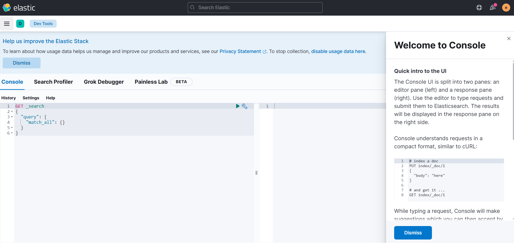

# ElasticSearch

- 분산형 검색 엔진
- 문서 저장소

<br />

## API 사용방법

- 키바나의 Dev Tools를 통해서 진행



- curl, 포스트맨 등의 도구를 사용하여 REST API를 직접 호출하는 방법

<br />

## ElasticSearch Index(엘라스틱서치의 인덱스)

- 인덱스(Index)는 여러 개의 프라이머리 샤드(Primary Shard)로 구성됨
- 프라이머리 샤드(Primary Shard)는 레플리카 샤드(Replica Shard)로 복제됨
- 각 샤드(Shard)는 색인 및 검색 요청을 처리할 수 있는 루씬 인덱스의 인스턴스임
- 프라이머리 샤드는 읽기, 쓰기 요청 모두 처리가능, 레플리카 샤드는 읽기전용
- 색인 요청은 레플리카 샤드가 성공적으로 업데이트 된 후에 승인도어 읽기 일관성 보장

### 색인(Indexing)

- 문서를 엘라스틱서치 인덱스에 기록하는 작업
- Create Index API를 사용해 인덱스를 생성할 수 있음

```json
//  인덱스 생성
// PUT my-index
{
  "settings": {
    "index": {
      "number_of_shards": 3,
      "number_of_replicas": 1
    }
  }
}

// Response
{
  "acknowledged" : true,
  "shards_acknowledged" : true,
  "index" : "my-index"
}
```

```json
// 인덱스 읽기
// GET my-index
{
    "my-index": {
        "aliases": {},
        "mappings": {},
        "settings": {
            "index": {
                "routing": {
                    "allocation": {
                        "include": {
                            "_tier_preference": "data_content"
                        }
                    }
                },
                "number_of_shards": "3",
                "provided_name": "my-index",
                "creation_date": "1770539054873",
                "number_of_replicas": "1",
                "uuid": "MpiVvfGYQg649QQYP4BptQ",
                "version": {
                    "created": "8000199"
                }
            }
        }
    }
}
```

```json
// 클러스터 내의 전체 인덱스 읽기
// GET _cat/indices
// yellow open my-index MpiVvfGYQg649QQYP4BptQ 3 1 0 0 675b 675b

// 결과값이 yellow로 왔음

// 레플리카가 오버스펙이므로 설정 변경
// PUT my-index/_settings
{
    "number_of_replicas": 0
}

// 클러스터 내의 전체 인덱스 읽기
// GET _cat/indices
// green open my-index MpiVvfGYQg649QQYP4BptQ 3 0 0 0 675b 675b
```

`※ 각 사드의 설정`

- 샤드는 데이터의 유형, 사용 방법에 따라서 30 ~ 50 GB의 데이터를 저장하는 것을 권한
- 고성능 검색의 경우 샤드의 크기를 줄이고, 로깅 작업일 경우 클러스터에 많은 데이터를 저장하도록 샤드의 크기를 늘림

#### 문서(JSON 객체)의 필드(키/값 쌍) - DB의 행과 열

- 엘라스틱서치의 JSON 문서는 필드(또는 키/값 쌍)로 구성
- SQL 데이터베이스에서 테이블의 열과 비슷

#### 색인(저장) 방법 - 명시적 문서 ID를 사용

```json
// PUT my-index/_doc/1
{
    "year": 2026,
    "city": "seoul",
    "country": "korea"
}

// PUT my-index/_doc/2
{
    "year": 2026,
    "city": "jeju",
    "country": "korea"
}

// Response
{
  "_index" : "my-index",
  "_id" : "2",
  "_version" : 1,
  "result" : "created",
  "_shards" : {
    "total" : 1,
    "successful" : 1,
    "failed" : 0
  },
  "_seq_no" : 0,
  "_primary_term" : 1
}

// 색인결과
// GET my-index/_search
{
  "took" : 799,
  "timed_out" : false,
  "_shards" : {
    "total" : 3,
    "successful" : 3,
    "skipped" : 0,
    "failed" : 0
  },
  "hits" : {
    "total" : {
      "value" : 2,
      "relation" : "eq"
    },
    "max_score" : 1.0,
    "hits" : [
      {
        "_index" : "my-index",
        "_id" : "2",
        "_score" : 1.0,
        "_source" : {
          "year" : 2026,
          "city" : "jeju",
          "country" : "korea"
        }
      },
      {
        "_index" : "my-index",
        "_id" : "1",
        "_score" : 1.0,
        "_source" : {
          "year" : 2026,
          "city" : "seoul",
          "country" : "korea"
        }
      }
    ]
  }
}
```

#### 색인(저장) 방법 - ID를 자동생성

```json
// POST my-index/_doc/
{
    "year": 2026,
    "city": "busan",
    "country": "korea"
}

// POST my-index/_doc/
{
    "year": 2026,
    "city": "daegu",
    "country": "korea"
}

// Response
{
  "_index" : "my-index",
  "_id" : "7FFzPJwBB-P0iF0OFJuh",
  "_version" : 1,
  "result" : "created",
  "_shards" : {
    "total" : 1,
    "successful" : 1,
    "failed" : 0
  },
  "_seq_no" : 0,
  "_primary_term" : 1
}

```

※ 자동 ID 생성의 경우가 더 효율적, 직접 지정시 \_id가 프라이머리 샤드에 존재하는지 확인 후 진행하기 때문임

<br />

### 인덱스 매핑 - DB 스키마

- 문서의 모든 필드는 엘라스틱서치의 데이터 유형에 매핑되어야함
- 매핑은 각 필드의 데이터 유형을 저장, 검색을 위해 필드를 색인 및 분석하는 방법을 결정
- 테이블을 정의하는 스키마와 비슷한 역할임
- 명시적 선언 or 동적 생성

- 예시

```json
{
    "year": 2026,
    "city": "daegu",
    "country": "korea",
    "population": 2.25
}
```

위처럼 색인요청을 했을 경우

- year: long 타입으로 정의
- city: text 타입으로 정의, keyword 타입으로 정의된 city.keyword라는 필드도 자동으로 생성하여 추가
- country: text 타입으로 정의, keyword 타입으로 정의된 country.keyword라는 필드도 자동으로 생성하여 추가
- population: float 타입으로 정의

```json
// GET my-index/_mapping

{
    "my-index": {
        "mappings": {
            "properties": {
                "city": {
                    "type": "text",
                    "fields": {
                        "keyword": {
                            "type": "keyword",
                            "ignore_above": 256
                        }
                    }
                },
                "country": {
                    "type": "text",
                    "fields": {
                        "keyword": {
                            "type": "keyword",
                            "ignore_above": 256
                        }
                    }
                },
                "year": {
                    "type": "long"
                },
                "population": {
                    "type": "float"
                }
            }
        }
    }
}

// POST my-index/_doc/
{
    "year": "2026",
    "city": "busan",
    "country": "korea",
    "population": "2.25 TEST"
}

// 매핑이 에러가 나야함, float 타입이었으나 다른 타입으로 색인을 했으니...
// 근데 안남...?
```

#### 인덱스 매핑의 명시적 정의

```json
// PUT my-explicit-index
{
    "mappings": {
        "properties": {
            "year": {
                "type": "integer"
            },
            "city": {
                "type": "keyword"
            },
            "country": {
                "type": "keyword"
            },
            "popultion": {
                "type": "float"
            },
            "attractions": {
                "type": "text"
            }
        }
    }
}

// Response
{
  "acknowledged" : true,
  "shards_acknowledged" : true,
  "index" : "my-explicit-index"
}
```

- 새로운 인덱스에 색인

```json
// POST my-explicit-index/_doc
{
    "year": "2021",
    "city": "Melbourne",
    "country": "Australia",
    "population": 4.936,
    "attractions": "Queen Victora markets, National Galleryof Victoria, ..."
}

// Response
{
  "_index" : "my-explicit-index",
  "_id" : "9FGBPJwBB-P0iF0O6Zu3",
  "_version" : 1,
  "result" : "created",
  "_shards" : {
    "total" : 2,
    "successful" : 1,
    "failed" : 0
  },
  "_seq_no" : 0,
  "_primary_term" : 1
}
```

<br />

<br />

## ElasticSearch Data Type (엘라스틱서치의 데이터 타입)

참조 URL - https://www.elastic.co/guide/en/elasticsearch/reference/8.0/mapping-types.html

1. keyword(키워드)

2. text(텍스트)

3. numeric(숫자)
    - integer
    - long
    - double
    - float

4. date(날짜)
    - long
    - integer
    - 문자열: yyyy-MM-dd HH:mm:ss

5. IP
    - ip
    - ip_range

6. bool(부울)
    - boolean

7. gep_point(지리적 위치 데이터)
    - lat, lon 값을 포함하는 객체

8. object(객체)
    - 엘라스틱 서치에 의해 평탄화 됨

```json
{
    "event": {
        "type": "http",
        "status": "complete"
    },
    "http": {
        "response": {
            "code": 500
        },
        "version": "1.1"
    },
    "@timestamp": "2020-12-23T03:53:36.431Z"
}

// 평탄화
{
    "evnet.type":"http",
    "event.status":"complete",
    "http.response.code": 500,
    "http.version": "1.1",
    "@timestamp": "2020-12-23T03:53:36.431Z"
}
```

9. array(배열)
    - 하나의 필드에 둘 이상의 값을 배열 형태로 저장
    - 명시적으로 정의하지 않음
    - 하나의 배열은 단일 데이터 타입만 보유

```json
{
    "tags": ["A", "B", "C"]
}

// 객체 배열
{
    "stores" : [
        {
            "suburb": "A",
            "capacity": 0
        },
        {
            "suburb": "B",
            "capacity": 1
        },
        {
            "suburb": "C",
            "capacity": 2
        }
    ]
}

// 객체 배열 평탄화
{
    "stores.suburb": ["A", "B", "C"],
    "stores.capacity": [0, 1, 2]
}
```

10. nested(중첩)
    - 객체를 배열로 색인하여 쿼리를 위한 객체 내부의 연관성 정보를 유지
    - 참고 url
        - https://www.elastic.co/guide/en/elasticsearch/reference/8.0/query-dsl-nested-query.html

11. join(조인)
    - 문서간의 부모/자식 관계를 생성
    - 동일한 샤드에 존재해야함

```json
// PUT department-employees
{
    "mappings": {
        "properties": {
            "dept_id": { "type": "keyword" },
            "dept_name": { "type": "keyword" },
            "employee_id": { "type": "keyword" },
            "employee_name": { "type": "keyword" },
            "doc_type": {
                "type": "join",
                "relations": {
                    "department": "employee"
                }
            }
        }
    }
}

// 부서색인(부모)

// PUT department-employees/_doc/d1
{
    "dept_id": "D001",
    "dept_name": "Finance",
    "doc_type": "department"
}
// PUT department-employees/_doc/d2
{
    "dept_id": "D002",
    "dept_name": "HR",
    "doc_type": "department"
}
// PUT department-employees/_doc/d3
{
    "dept_id": "D003",
    "dept_name": "IT",
    "doc_type": "department"
}

// 직원색인(자식)
// PUT department-employees/_doc/e1?routing=1
{
    "employee_id": "E001",
    "employee_name": "Sarah",
    "doc_type": {
        "name": "employee",
        "parent": "d3"
    }
}

// PUT department-employees/_doc/e1?routing=2
{
    "employee_id": "E002",
    "employee_name": "Sarah",
    "doc_type": {
        "name": "employee",
        "parent": "d3"
    }
}

// PUT department-employees/_doc/e1?routing=3
{
    "employee_id": "E003",
    "employee_name": "Sarah",
    "doc_type": {
        "name": "employee",
        "parent": "d2"
    }
}
```

위 처럼 색인후 has_parent와 has_child 쿼리를 사용해 데이터에 대해 조인 검색을 실행

```json
// IT 부서에서 일하는 직원 목록을 가져올 경우
// GET department-employees/_search
{
    "query": {
        "has_parent": {
            "parent_type": "department",
            "query": {
                "term": {
                    "dept_name": { "value": "IT" }
                }
            }
        }
    }
}

// Ben이 근무하는 부서를 검색하려면 다음을 실행
// GET department-employees/_search
{
    "query": {
        "has_parent": {
            "parent_type": "employee",
            "query": {
                "term": {
                    "dept_name": { "employee_name": "Ben" }
                }
            }
        }
    }
}
```

<br />

<br />

## Index Template(인덱스 템플릿)

- 인덱스 템플릿은 인덱스 설정 및 매핑을 위한 청사진
- 데이터 소스를 여러 인덱스에 분산하는 것이 일반적

```json
// PUT _index_template/logs-firewall
{
    "index_patterns": ["firewall-logs*"],
    "template": {
        "settings": {
            "number_of_shards": 2
        },
        "mappings": {
            "properties": {
                "@timestamp": { "type": "date" },
                "source.ip": { "type": "ip" },
                "destination.ip": { "type": "ip" },
                "event.action": { "type": "keyword" },
                "user.name": { "type": "keyword" },
                "client.bytes": { "type": "double" }
            }
        }
    }
}

// Response
{
  "acknowledged" : true
}

// POST firewall-logs-10.12.2020/_doc
{
    "@timestamp": "2020-12-23T03:53:36.431Z",
    "source.ip": "10.12.100.2",
    "destination.ip": "10.15.10.2",
    "event.action": "deny",
    "user.name": "bob",
    "client.bytes": 2
}

// Response
{
  "_index" : "firewall-logs-10.12.2020",
  "_id" : "9lG6PJwBB-P0iF0Oq5tH",
  "_version" : 1,
  "result" : "created",
  "_shards" : {
    "total" : 2,
    "successful" : 1,
    "failed" : 0
  },
  "_seq_no" : 0,
  "_primary_term" : 1
}

// GET firewall-logs-10.12.2020
{
  "firewall-logs-10.12.2020" : {
    "aliases" : { },
    "mappings" : {
      "properties" : {
        "@timestamp" : {
          "type" : "date"
        },
        "client" : {
          "properties" : {
            "bytes" : {
              "type" : "double"
            }
          }
        },
        "destination" : {
          "properties" : {
            "ip" : {
              "type" : "ip"
            }
          }
        },
        "event" : {
          "properties" : {
            "action" : {
              "type" : "keyword"
            }
          }
        },
        "source" : {
          "properties" : {
            "ip" : {
              "type" : "ip"
            }
          }
        },
        "user" : {
          "properties" : {
            "name" : {
              "type" : "keyword"
            }
          }
        }
      }
    },
    "settings" : {
      "index" : {
        "routing" : {
          "allocation" : {
            "include" : {
              "_tier_preference" : "data_content"
            }
          }
        },
        "number_of_shards" : "2",
        "provided_name" : "firewall-logs-10.12.2020",
        "creation_date" : "1770545383214",
        "number_of_replicas" : "1",
        "uuid" : "ukAKwV_LQIqhiMxnlyZRgQ",
        "version" : {
          "created" : "8000199"
        }
      }
    }
  }
}

// GET firewall-logs-10.12.2020/_search

// Response
{
  "took" : 3,
  "timed_out" : false,
  "_shards" : {
    "total" : 2,
    "successful" : 2,
    "skipped" : 0,
    "failed" : 0
  },
  "hits" : {
    "total" : {
      "value" : 1,
      "relation" : "eq"
    },
    "max_score" : 1.0,
    "hits" : [
      {
        "_index" : "firewall-logs-10.12.2020",
        "_id" : "9lG6PJwBB-P0iF0Oq5tH",
        "_score" : 1.0,
        "_source" : {
          "@timestamp" : "2020-12-23T03:53:36.431Z",
          "source.ip" : "10.12.100.2",
          "destination.ip" : "10.15.10.2",
          "event.action" : "deny",
          "user.name" : "bob",
          "client.bytes" : 2
        }
      }
    ]
  }
}
```

<br />

<br />

## ElasticSearch Node(엘라스틱서치 노드)

1. 마스터 후보 노드

2. 투표 전용 노드

3. 데이터 노드

4. 인제스트 노드

5. 코디네이터 노드

6. 머신러닝 노드

### 엘라스틱서치 클러스터

- 하나 이상의 엘라스틱서치 노ㄴ드가 모여 `엘라스틱서치 클러스터`를 만듬

- 노드가 처음 실행될 때 마스터 후보 노드를 검색해 클러스터 구성 프로세스에 착수

- 클러스터에 가입하고 참여할 경우, 클러스터의 모든 노드가 동일한 `cluster.name` 속성을 가져야 함

<br />
